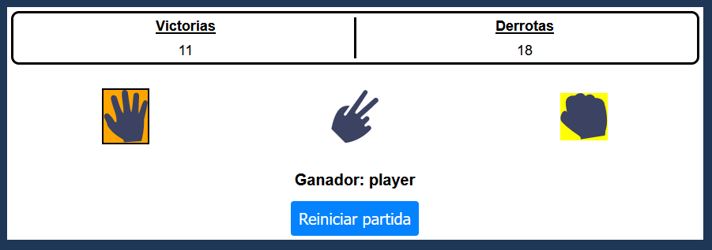

# PiedraPapelTijera

This is a js project based on rock, paper, scissors game.

## Table of contents

- [Description](#description)
- [Technologies](#technologies)
- [Installation](#installation)

## Description

This is a js project based on rock, paper, scissors game. The player will be able to select any option manually and the machine will select another option but randomly.

The results will be saved in localStorage so that the player knows at all times the wins and losses he has against the machine.

## Technologies

The project has been created with:

- HTML
- CSS
- JS

## Installation

To run this project, we need the following steps:

- Disable the option to delete cookies and data from the site when the browser is closed, so that the information is displayed in the application correctly. This option will be found in your browser settings.

- Download the Live Server extension, which is found in the vscode editor

- Once the extension is downloaded, run the extension and everything will work correctly

- If you get an error, try running the application normally using the index.html file
